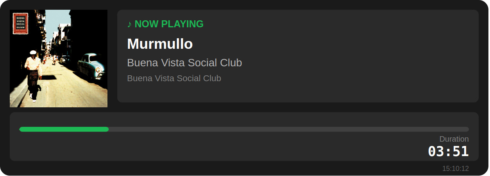

# Soundevice Sandbox

This repository contains a sandbox project for experimenting with Soundevice and Spotify API integration. It includes configuration settings, SVG generation for visualizing track information, and scripts to interact with Spotify's services.

--- 

## Getting Started

1. Clone the repository:
   ```bash
   git clone https://github.com/yourusername/soundevice-sandbox.git
   cd soundevice-sandbox
   ```

2. Create a virtual environment and activate it:
   ```bash
   python -m venv venv
   source venv/bin/activate  # On Windows use `venv\Scripts\activate`
   ```

3. Install the required packages:
   ```bash
   pip install -r requirements.txt
   ```
   
   > **Note:** If you see a warning `Defaulting to user installation because normal site-packages is not writeable`, use `pip install --no-user -r requirements.txt` instead to ensure packages are installed into the venv.

4. Set up your environment variables:
   - Copy the `.env.example` file to `.env` and fill in your Spotify API credentials.

5. Run the application:
   ```bash
   python main.py
   ```
   
   Or alternatively:
   ```bash
   python -m src
   ```

6. Quit the virtual environment when done:
   ```bash
   deactivate
   ```
---

## Project Structure

```
src/
├── __init__.py           # Package initialization
├── app.py               # Flask application and routes
├── config.py            # Configuration and constants
├── spotify_service.py   # Spotify API client
└── svg_generator.py     # SVG visualization generator
main.py                 # Application entry point
```

---

## Configuration

Configuration settings can be found in the `config.py` file. Adjust the settings as needed for your development environment.

---

## SVG Generation

The `svg_generator.py` module is responsible for generating SVG images that visualize track information retrieved from the Spotify API. You can customize the SVG dimensions and styles in the `config.py` file.

**SVG Results Example:**



---

## Getting Spotify API Credentials

To obtain Spotify API credentials, follow these steps:
1. Visit the [Spotify Developer Dashboard](https://developer.spotify.com/dashboard).
2. Log in with your Spotify account.
3. Click on "Create an App".
4. Fill in the required details and agree to the terms.
5. Once the app is created, you will find your `Client ID` and `Client Secret` on the app's dashboard.
6. Copy these values into your `.env` file as follows:
   ```
   SPOTIFY_CLIENT_ID=your_client_id_here
   SPOTIFY_CLIENT_SECRET=your_client_secret_here
   ```

## License
This project is licensed under the MIT License - see the [LICENSE](LICENSE) file for details


